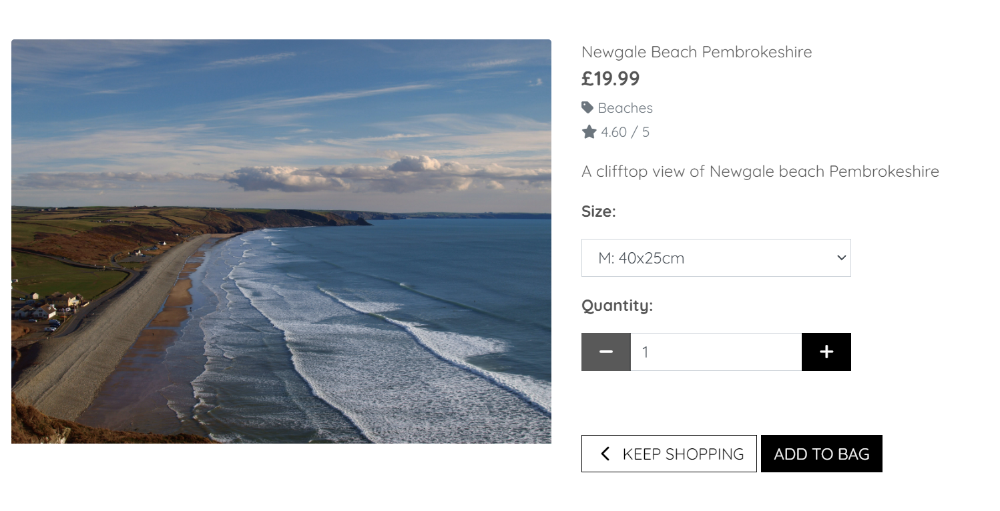

# Testing

Return back to the [README.md](README.md) file.

In this section, I will present proof to demonstrate that:
- The project **features** work as intended
- The **users** can achieve their goals
- The project is **responsive** across different devices and screen sizes
- The project is **compatible** across different web browsers
- The project uses **valid code** according to standard practice
- The project passes audits for **performance, accessibility, best practices and SEO** (using Lighthouse by Chrome Developer Tools)

## Code Validation

I will use this space to discuss code validation of my code files (where applicable).

### HTML

I have used the recommended [HTML W3C Validator](https://validator.w3.org) to validate the home page as the majority of the html is stored in the base.html template.

| Page | W3C URL | Screenshot | Notes |
| --- | --- | --- | --- |
| Home | [W3C](https://validator.w3.org/nu/?doc=https%3A%2F%2Fjc-photography-8161a9b140c8.herokuapp.com%2F) |  | ! error for duplicate id however the way it is set up 1 will always be hidden depending on the screen size |

### CSS

I have used the recommended [CSS Jigsaw Validator](https://jigsaw.w3.org/css-validator) to validate my CSS.

| File | Jigsaw URL | Screenshot | Notes |
| --- | --- | --- | --- |
| style.css | [Jigsaw](https://jigsaw.w3.org/css-validator/validator?uri=https%3A%2F%2Fjc-photography-8161a9b140c8.herokuapp.com%2F&profile=css3svg&usermedium=all&warning=1&vextwarning=&lang=en) |  | Pass: No Internal Errors |

## Browser Compatibility

I've tested my deployed project on multiple browsers to check for compatibility issues.

| Browser | Screenshot | Notes |
| --- | --- | --- |
| Chrome |  | Works as expected |
| Firefox |  | Works as expected |
| Edge |  | Works as expected |

## Responsiveness

I've tested my deployed project on multiple screen sizes to check for responsiveness issues.

| Device | Screenshot | Notes |
| --- | --- | --- |
| Mobile (DevTools) |  | Works as expected |
| Tablet (DevTools) |  | Works as expected |
| Desktop |  | Works as expected |

## Lighthouse Audit

I've tested my deployed project using the Lighthouse Audit tool to check for any major issues.

| Page | Size | Screenshot | Notes |
| --- | --- | --- | --- |
| Home | Mobile |  | A few warnings mainly caused by large image sizes |
| Home | Desktop |  | A few warnings mainly caused by large image sizes |

## Defensive Programming

Defensive programming was manually tested with the below user acceptance testing:

| Page | User Action | Expected Result | Pass/Fail | Comments |
| --- | --- | --- | --- | --- |
| Home Page | | | | |
| | Click on Menu Item | All menu links goto the correct location | Pass | |
| Login Page | | | | |
| | Attempt to login | If you use the correct details it will login and if not user will get feedback | Pass | |
| Registration Page | | | | |
| | Attempt to register | If the username is unique and the username and password match the criteria it will create account and login otherwise the user will receive feedback| Pass | |

## User Story Testing

| User Story | Screenshot |
| --- | --- |
| As a new site user, I would like to easily browse through different categories of prints offered by Justin Cooper Photography, allowing me to quickly find what I'm interested in. |  |
| As a new site user, I would like to have a straightforward registration process that enables me to create an account efficiently, ensuring I can easily track my orders and access my purchase history. |  |
| As a new site user, I would like to have clear and intuitive navigation menus that help me explore the website effortlessly, making it convenient to find the information I need. |  |
| As a site user, I would like to have access to detailed product descriptions and high-quality images for each print, enabling me to make informed purchasing decisions. |  |
| As a site user, I would like to have a seamless checkout experience, ensuring a smooth and secure transaction process. |  |